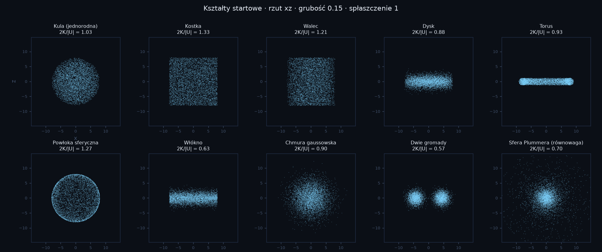
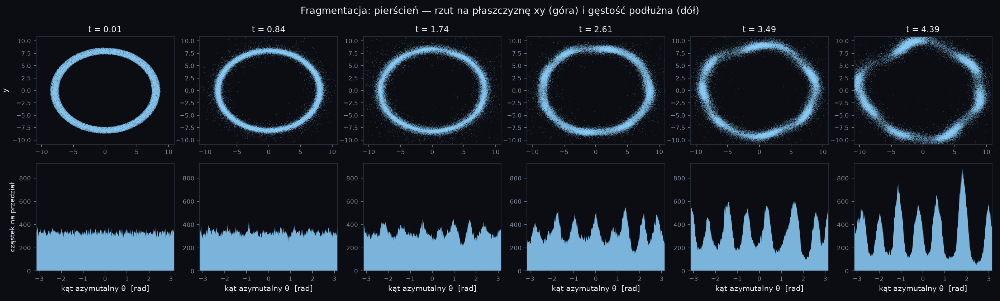

# Bone

Grawitacja N ciał na jednym komputerze. Dwa modele, jeden silnik, jedna aplikacja
w Ruście — okno z panelem albo bieg wsadowy z wiersza poleceń.

- **`sr`** — odosobniona chmura cząstek. Grawitacja newtonowska, kinematyka
  szczególnej teorii względności, dyssypacja zależna od gęstości.
- **`lcdm`** — próbka materii w modelu standardowym kosmologii (Planck 2018).
  Warunki początkowe z widma mocy, całkowanie po `ln a` od `z = 49` do dziś.

Błąd solvera przybliżonego jest **mierzony i pokazywany**, nie zakładany. To jedyna
liczba, która odróżnia przybliżenie od usterki.

## Budowanie i uruchamianie

```bash
cd cosmo
cargo build --release          # wynik: target/release/BoneCosmo
cargo test --workspace         # 248 testów
cargo clippy --workspace --all-targets -- -D warnings
```

```bash
BoneCosmo                                        # okno z panelem
BoneCosmo presety                                # nazwy zestawów nastaw SR
BoneCosmo sr   --zestaw fragmentation --kroki 2000 --do runs/frag
BoneCosmo lcdm --zestaw struktury --do runs/lss
BoneCosmo sr   --wznow --do runs/frag            # dalej z checkpointu
BoneCosmo lcdm --wznow --do runs/lss             # to samo dla ΛCDM
BoneCosmo --pomoc
```

Bieg wsadowy zostawia w katalogu wyjściowym `checkpoint.bin` (pełny stan w `f64`,
do wznowienia), `config.json` (użyte parametry) i `frames/` z indeksem
`trajectory.json` (klatki w `f32`, do oglądania).

## Model SR: co to liczy

Zmienną stanu jest **pęd**, nie prędkość:

```
dx/dt = p c² / E,        E = √((pc)² + (mc²)²)
dp/dt = F
```

Prędkość wynika z pędu, więc `|v| < c` jest spełnione **tożsamościowo** — nie ma
obcinania prędkości ani sprawdzania warunków. Nawet dla pędu 10³⁰⁰ nie powstaje `NaN`.

Siła jest newtonowska, ze zmiękczeniem Plummera:

```
F_i = −G mᵢ Σⱼ mⱼ (xᵢ − xⱼ) / (|xᵢ − xⱼ|² + ε²)^{3/2}
```

Całkowanie: leapfrog KDK na pędzie, krok adaptacyjny `dt ≤ η√(ε/a_max)`.

### Czego to NIE jest

To model „kinematyka SR + siła Newtona", a nie ogólna teoria względności:

- grawitacja jest natychmiastowa — bez opóźnienia, fal grawitacyjnych i pędu pola;
- źródłem grawitacji jest masa spoczynkowa, nie pełny tensor energii-pędu;
- dlatego środek masy spoczynkowej powoli wędruje, mimo że `Σp = 0` jest zachowane
  dokładnie. Nie jest to usterka — dryf zgadza się z przewidywaniem kinematycznym
  co do rzędu wielkości;
- brak horyzontów zdarzeń i precesji peryhelium.

## Model ΛCDM: co to liczy

Tło z parametrów Plancka 2018, widmo mocy Eisensteina i Hu (wariant bez oscylacji
barionowych) znormalizowane przez `σ₈`, przesunięcia Zel'dovicha jako warunek
początkowy, leapfrog KDK po `ln a`.

Ograniczenie, które trzeba wypowiedzieć wprost: **brzegi są izolowane, nie
periodyczne**. Liczona jest odosobniona próbka materii w pustej przestrzeni, a nie
kawałek jednorodnego wszechświata z nieskończonym ciągiem kopii. Na brzegu próbki
brakuje przyciągania z zewnątrz, więc krawędź rusza się wolniej od środka. Za to nic
nie zawija się przez ścianę i chmura może się swobodnie zapadać.

## Kształty startowe (SR)

Dziesięć rozkładów: `ball`, `cube`, `cylinder`, `disk`, `torus`, `sphere_shell`,
`filament`, `gaussian`, `two_clumps`, `plummer`. Proporcje ustawiają dwa pokrętła:

- **`thickness`** — przekrój poprzeczny, dla kształtów, które go mają (dysk, torus,
  włókno). To on, a nie promień, wyznacza długość fali fragmentacji (λ ≈ 3,6·σ).
- **`flatten`** — mnożnik osi z, działa na **każdy** kształt. Rozmiar (`radius`) jest
  przez to oddzielony od proporcji, więc zmiana kształtu nie zmienia przy okazji skali.



Te same dziesięć kształtów po spłaszczeniu (`flatten = 0,25`) i w rzucie z góry:
[`docs/shapes_flat.png`](docs/shapes_flat.png),
[`docs/shapes_top.png`](docs/shapes_top.png).

### Dlaczego warunek startowy zadaje się wiriałem, a nie temperaturą

Ta sama dyspersja prędkości **nie jest porównywalna między kształtami**. Zmierzone
2K/|U| przy identycznej masie, promieniu, G i dyspersji:

| kształt | kostka | powłoka | walec | kula | chmura | torus | dysk | Plummer | włókno | dwie gromady |
|---|---|---|---|---|---|---|---|---|---|---|
| 2K/\|U\| | 1,33 | 1,27 | 1,21 | 1,03 | 0,90 | 0,93 | 0,88 | 0,70 | 0,63 | 0,57 |

Rozrzut jest 2,3-krotny, a granica stabilności leży w środku tego przedziału. Bieg
z ustaloną temperaturą miesza więc wpływ geometrii z wpływem tego, jak daleko od
równowagi kształt wystartował — i nie pozwala rozstrzygnąć, co spowodowało wynik.

Dlatego istnieje parametr **`virial`**: podaje się docelowe 2K/|U|, a dyspersja jest
dobierana do energii potencjalnej *tego* kształtu (bisekcja po relatywistycznej energii
kinetycznej, |U| z podpróbki liczonej dokładnie). `virial = 0` oddaje kontrolę suwakowi
temperatury.

## Dwa solwery grawitacji

| | `exact` | `mesh` |
|---|---|---|
| metoda | dokładne sumowanie par | siatka cząstek (PM) z FFT |
| koszt | `O(N²)` | `O(N + M log M)`, `M = (2·grid)³` |
| błąd siły | zero (definicja) | mierzony: 0,3–1% na gładkiej chmurze, do 15% po powstaniu zgęstek |
| precyzja | `f64` | `f64` na cząstkach, `f32` na siatce |

Zmierzone na 22 rdzeniach (wydanie `release`, milisekundy na krok):

| solver | siatka | N = 4 000 | N = 20 000 | N = 120 000 |
|---|---|---|---|---|
| `exact` | — | 9,5 | 408 | ~15 000 (ekstrapolacja) |
| `mesh` | 48 | 16 | 16 | 16 |
| `mesh` | 96 | 90 | 90 | 90 |
| `mesh` | 192 | 1 480 | 1 480 | 1 480 |

Koszt siatki nie zależy od liczby cząstek, tylko od siatki — i między siatką 64 a 192
różni się czterdziestokrotnie. Dlatego `auto` **nie** ma stałego progu w cząstkach:
porównuje `N²` z `(2·grid)³·log₂(2·grid)` i wybiera tańszy solver. Przy siatce 64
granica wypada w okolicy 8 tys. cząstek, przy 192 — ponad 40 tys.

### Jak działa `mesh` i gdzie kłamie

Pudło jest **zerowo dopełnione** do podwojonego rozmiaru, a jądro grawitacyjne liczone
metodą Hockneya. Dzięki temu brzegi są izolowane, a nie periodyczne — chmura nie
oddziałuje ze swoimi kopiami, co jest typowym błędem naiwnej implementacji na FFT.
Masa jest rozkładana schematem CIC, a jego wygładzanie odkręcane w przestrzeni
Fouriera; bez tej korekty błąd siły wynosił 5–9% zamiast 1–2%.

Dwa ograniczenia, o których warto wiedzieć:

1. **PM rozdziela grawitację tylko do rozmiaru oczka.** Jeśli poprosisz o `ε` mniejsze
   niż komórka, solver podniesie je do rozmiaru komórki i **powie o tym**. Alternatywa
   — udawać, że liczy z zamówionym `ε` — dawałaby ładniejszy komunikat i gorszą fizykę.
2. **Błąd rośnie, gdy układ wytworzy strukturę drobniejszą od oczka**, i rośnie mocno.
   Zmierzone na presecie `dissipation` (120 tys. cząstek, siatka 128, chłodzenie
   zagęszczające materię):

   | krok | błąd siły | dryf energii |
   |---|---|---|
   | 200 | 0,30% | 0,008 |
   | 400 | 10,3% | 0,000 |
   | 800 | 14,3% | 0,45 |
   | 1000 | 14,7% | 0,40 |

   Te dwie kolumny rosną razem i to nie jest zbieg okoliczności: dryf energii jest
   skutkiem błędu siły. Późna faza tego biegu **nie jest wynikiem ilościowym** — mówi
   „chłodzenie prowadzi do fragmentacji", a nie „fragmenty mają taką masę". Panel
   i bieg wsadowy pokazują wtedy podpowiedź „zagęść siatkę", więc nie da się tego
   przeoczyć. Właściwym lekarstwem byłoby dołożenie sumowania bliskiego zasięgu
   (P³M/TreePM); tego nie ma.

   Gładka chmura zachowuje się inaczej: preset `fragmentation` (120 tys. cząstek,
   pierścień, siatka 192) trzyma 0,95% błędu siły i dryf 2·10⁻⁵.



Ten sam pierścień policzony dokładnym `O(N²)`
([`docs/frag_ring_exact.png`](docs/frag_ring_exact.png)) daje ten sam obraz zgęstek —
to jest sprawdzenie, że fragmentacja jest fizyką, a nie artefaktem siatki. Wpływ
gęstości siatki i grubości przekroju: [`docs/frag_g192.png`](docs/frag_g192.png),
[`docs/frag_thin.png`](docs/frag_thin.png).

## Diagnostyka

Silnik liczy na bieżąco energię (kinetyczną relatywistyczną i potencjalną), pęd, moment
pędu, stosunek wirialny `2T/|U|`, promień połowy masy, statystyki `γ` i `β`, oraz
**zmierzony błąd siły** — przez porównanie z dokładnym `O(N²)` na losowej próbce.

Wielkość, na którą warto patrzeć, to dryf energii. Zmierzony na presecie `precision`
(2 tys. cząstek, solver dokładny, 200 kroków): **1,3·10⁻⁶**, oscylujący wokół zera,
a nie narastający — sygnatura poprawnego całkowania, a nie tłumienia. W biegu
z chłodzeniem wielkością zachowaną jest `E + energia odprowadzona`, i to jej dryf
jest raportowany.

Dryf rzędu 10⁻⁶ dotyczy solvera dokładnego. Na siatce jest ograniczony przez błąd
siły — patrz tabela wyżej.

Dla ΛCDM analogiczną miarą jest reszta równania Layzera–Irvine'a; maleje z krokiem,
co sprawdza osobny test.

## Dobór parametrów

Dwie rzeczy, na które łatwo się nadziać:

**Masa jest masą całego układu**, nie jednej cząstki. Dlatego przesunięcie suwaka
liczby cząstek zmienia rozdzielczość, a nie badany obiekt — energia i `β_max` zostają
takie same od tysiąca do 120 tys. cząstek.

**Za duże `G` przy danym `c` czyni orbitę kołową niespełnialną.** Prędkości startowe
trafiłyby wtedy na limit, układ wystartowałby z dodatnią energią i rozleciał się. Kod
to wykrywa i ostrzega, zamiast po cichu przyciąć. Żeby dobrać `G` świadomie, jest
`sr::config::gravity_for_beta(total_mass, radius, c, beta)`.

## Struktura

```
cosmo/
  core/          bone-core — fizyka, I/O, sesja, CLI
    vec3, rng, fft, grid, mesh
    sr/          relativity, state, config, presets, spawn,
                 backends/exact, integrator, cooling, diagnostics, engine
    lcdm/        units, cosmology, power, ics, engine, presets
    io/          binary, checkpoint, trajectory
    session.rs   wspólna pętla: krok, diagnostyka, zapis
    cli.rs       bieg wsadowy
  ui/            bone-ui — kamera, renderer, panel, odtwarzacz
  app/           binarka BoneCosmo
```

Oba modele różnią się kinematyką i warunkami początkowymi, nie sposobem liczenia
grawitacji — dlatego `mesh`, `grid`, `fft`, `vec3` i `rng` są wspólne. To nie jest
dążenie do współdzielenia kodu, a obserwacja, że obie symulacje rozwiązują to samo
równanie Poissona.

Strona z opisem i odnośnikiem do wydania leży w `www/` (statyczna, nic nie liczy).
