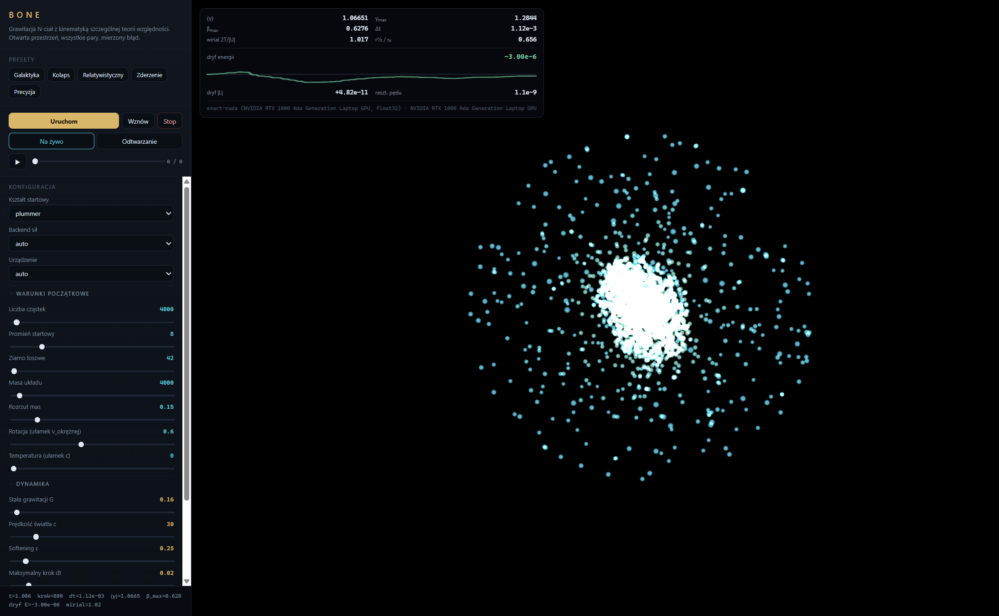

# Bone

Grawitacja N-ciał z kinematyką szczególnej teorii względności. Otwarta przestrzeń
bez ścian, wszystkie pary oddziałują, a błąd przybliżenia jest **mierzony i pokazywany**,
nie zakładany.



## Co to właściwie liczy

Zmienną stanu jest **pęd**, nie prędkość:

```
dx/dt = p c² / E,        E = √((pc)² + (mc²)²)
dp/dt = F
```

Prędkość wychodzi z pędu, więc `|v| < c` jest spełnione **tożsamościowo** — nie ma
żadnego obcinania prędkości ani sprawdzania warunków. Nawet dla pędu 10³⁰⁰ obliczenia
nie produkują `NaN` (patrz `tests/test_relativity.py`).

Siła jest **newtonowska**, ze zmiękczeniem:

```
F_i = -G mᵢ Σⱼ mⱼ (xᵢ - xⱼ) / (|xᵢ - xⱼ|² + ε²)^{3/2}
```

Całkowanie: leapfrog KDK (kick-drift-kick) na pędzie, z adaptacyjnym krokiem
`dt ≤ η√(ε/a_max)`.

### Czego to NIE jest

To model „kinematyka SR + siła Newtona", a nie ogólna teoria względności. Konkretnie:

- **grawitacja jest natychmiastowa** — nie ma opóźnienia, fal grawitacyjnych ani pędu
  niesionego przez pole;
- źródłem grawitacji jest **masa spoczynkowa**, nie pełny tensor energii-pędu;
- dlatego środek masy spoczynkowej powoli wędruje, mimo że `Σp = 0` jest zachowane
  dokładnie. Nie jest to błąd kodu — `tests/test_conservation.py` sprawdza, że dryf
  zgadza się z przewidywaniem kinematycznym co do rzędu wielkości;
- brak horyzontów zdarzeń, precesji peryhelium i innych efektów OTW.

## Instalacja

```bash
python -m venv .venv
.\.venv\Scripts\activate
pip install -e ".[dev]"
pip install torch --index-url https://download.pytorch.org/whl/cu124   # GPU, opcjonalnie
```

Bez `torch` wszystko działa na CPU (NumPy), tylko wolniej.

## Użycie

```bash
python -m bone studio                                   # interfejs 3D w przeglądarce
python -m bone run --preset galaxy --steps 2000          # bieg bez okna
python -m bone bench --sizes 4000 100000 --backends exact mesh
```

Presety: `galaxy`, `collapse`, `relativistic`, `merger`, `precision`.

## Dwa backendy sił

| | `exact` | `mesh` |
|---|---|---|
| metoda | dokładne O(N²) przez GEMM | siatka cząstek (PM) z FFT |
| koszt | O(N²) | O(N + M log M) |
| błąd siły | zero (definicja) | mierzony, zwykle 0,6–2% |
| sensowne N | do ~5 000 interaktywnie | 10⁴–10⁶ |

`auto` wybiera `exact` do 4000 cząstek, wyżej `mesh`.

Zmierzone na RTX 1000 Ada Laptop (float32, siatka 96³, chmura Plummera):

| N | `exact` | `mesh` | błąd `mesh` |
|---|---|---|---|
| 1 000 | 6,6 ms | 27 ms | 2,0% |
| 4 000 | 30 ms | 25 ms | 1,2% |
| 20 000 | 638 ms | 30 ms | 0,6% |
| 100 000 | 15,9 s | 72 ms | — |

Przy 100 000 cząstek siatka jest **220× szybsza** od dokładnego sumowania. To laptopowe
GPU i mocno się grzeje — bezwzględne czasy wahają się między biegami nawet dwukrotnie,
proporcje są stabilne.

### Jak działa `mesh` i gdzie kłamie

Pudło jest **zerowo dopełnione** do podwojonego rozmiaru, a jądro grawitacyjne liczone
metodą Hockneya. Dzięki temu brzegi są **izolowane**, a nie periodyczne — chmura nie
oddziałuje ze swoimi kopiami, co jest typowym błędem naiwnej implementacji FFT.
Masa jest rozkładana schematem CIC, a jego wygładzanie odkręcane w przestrzeni Fouriera
(deconvolution) — bez tej korekty błąd siły wynosił 5–9% zamiast 1–2%.

Dwa ograniczenia, o których warto wiedzieć:

1. **PM rozdziela grawitację tylko do rozmiaru oczka.** Jeśli poprosisz o `ε` mniejsze
   niż komórka, backend podniesie je do rozmiaru komórki i **powie o tym** w opisie
   („ε podniesione do…"). Alternatywa — udawać, że liczy z zamówionym `ε` — dawałaby
   ładniejszy komunikat i gorszą fizykę.
2. **Błąd rośnie, gdy układ wytworzy strukturę drobniejszą od oczka.** Na gładkiej
   chmurze to 0,6%, ale dysk po 400 krokach ma zgęstki i błąd sięga 4–7%. Studio
   pokazuje wtedy podpowiedź „zagęść siatkę". Naturalnym następnym krokiem byłoby
   dołożenie sumowania bliskiego zasięgu (P³M/TreePM); na razie tego nie ma.

## Diagnostyka

Silnik liczy na bieżąco energię (kinetyczną relatywistyczną i potencjalną), pęd,
moment pędu, stosunek wirialny `2T/|U|`, promień połowy masy, statystyki `γ` i `β`,
oraz **zmierzony błąd siły** — przez porównanie z dokładnym O(N²) na losowej próbce
cząstek. Ten ostatni jest ważny: bez niego przybliżony solver nie różni się od
zepsutego.

Wielkość, na którą warto patrzeć, to dryf energii. Zmierzony na presecie `precision`
(2000 cząstek, backend dokładny, 600 kroków): **3·10⁻⁶**, oscylujący wokół zera,
a nie narastający — sygnatura poprawnego całkowania, a nie tłumienia.

Pęd całkowity jest zachowany do **10⁻¹²** względnie (granica float64).

## Dobór parametrów

Dwie rzeczy, na które łatwo się nadziać:

**Masa jest masą całego układu**, nie jednej cząstki. Dlatego przesunięcie suwaka
liczby cząstek zmienia rozdzielczość, a nie badany obiekt — energia i `β_max` zostają
takie same od 1000 do 100 000 cząstek.

**Za duże `G` przy danym `c` czyni orbitę kołową niespełnialną.** Wtedy prędkości
startowe trafiłyby na limit, układ wystartowałby z dodatnią energią i rozleciał się.
Kod to wykrywa i ostrzega, zamiast po cichu przyciąć. Żeby dobrać `G` świadomie:

```python
from bone.config import gravity_for_beta
G = gravity_for_beta(total_mass=4000, radius=10, c=30, beta=0.25)  # brzeg przy 0,25 c
```

## Testy

```bash
pytest -q       # 51 testów
```

Sprawdzają m.in.: zgodność `exact` z definicją siły liczoną wprost, III prawo Newtona,
izolowane (nieperiodyczne) brzegi w `mesh`, parzystość CPU–GPU, orbitę kołową dwóch
ciał względem rozwiązania analitycznego, zachowanie E/p/L, oraz stabilność
relatywistyki przy absurdalnych pędach.

## Struktura

```
src/bone/
  relativity.py     kinematyka SR (przepełnienio-odporna)
  state.py          x, p, m
  spawn.py          warunki początkowe
  config.py         konfiguracja + schemat UI + presety
  backends/         exact (GEMM), mesh (PM+FFT)
  integrator.py     leapfrog KDK + adaptacyjny krok
  diagnostics.py    wielkości zachowane, pomiar błędu siły
  engine.py         pętla symulacji
  io/               checkpoint, trajektoria, pakiet live
  studio/           serwer HTTP + frontend 3D (w pakiecie)
  cli.py            run / studio / bench
legacy/             poprzednia wersja, zachowana do porównania
```

`legacy/` to wcześniejsza implementacja. Jej model relatywistyczny polegał na
całkowaniu prędkości i obcinaniu jej do `0,95 c`, a grawitacja liczona była tylko
między `k` najbliższymi sąsiadami — czyli nie była grawitacją dalekiego zasięgu.
Nie miała też pomiaru żadnej wielkości zachowanej. Trzymana wyłącznie jako punkt
odniesienia.
